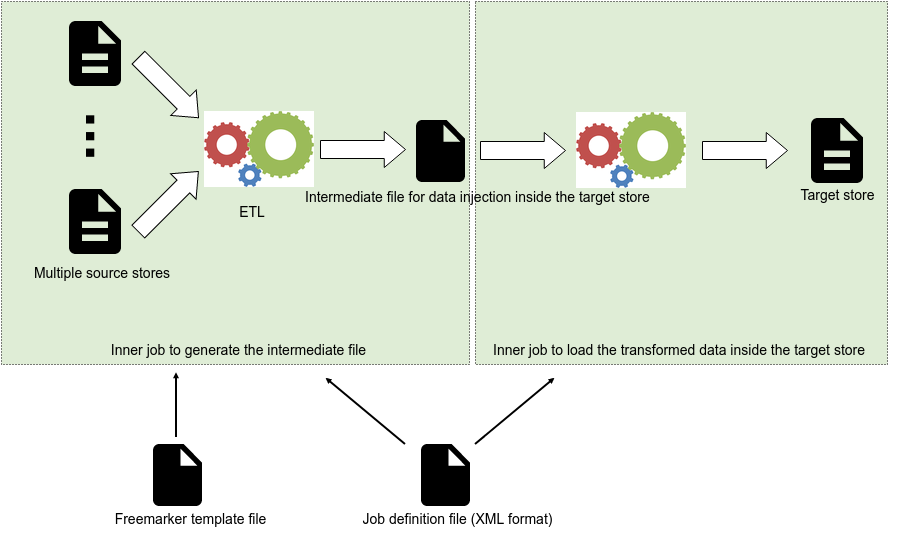
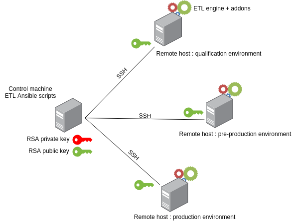

.................................................................. ..................................................................

# ALAMBIC
This project is an implementation of ETL product (Extract, Transform & Load) initiated by the Rennes Education Authority.

Its main assets are :
- offers a large number of input / output connectors,
- supports resultset paging on numerous connectors,
- supports any data format thanks to the [Freemarker templating engine](https://freemarker.apache.org),
- ease to parallelize treatments among multiple threads,
- ease to monitor the product inner activity and progression via JMX agents and [Jolokia protocol bridge technology](https://jolokia.org),
- rely on the widespread [Ansible](https://www.ansible.com/) scripting tool for deploying and running on multiple platforms.

# Table of contents
1. [Overview](#overview)
	1. [Supported input connectors](#supported-input-connectors)
	2. [Supported output connectors](#supported-output-connectors)
	3. [Data transformation](#data-transformation)
	4. [Overall principle](#overall-principle)
		1. [No templating or XSLT templating](#no-templating-or-xslt-templating)
		2. [With Freemarker templating](#with-freemarker-templating)
2. [Packaging](#packaging)
3. [Installation](#installation)
	1. [Deployment overview](#deployment-overview)
	2. [Control machine preparation](#control-machine-preparation)
		1. [Installation pre-requisites](#installation-pre-requisites)
		2. [Preparation](#preparation)
			1. [Multiple environments configuration](#multiple-environments-configuration)
			2. [Credentials protection](#credentials-protection)
	3. [Deployment on hosts](#deployment-on-hosts)
		1. [Deployment pre-requisites](#deployment-pre-requisites)
		2. [How to deploy an ETL version on a host](#how-to-deploy-an-etl-version-on-a-host)
			1. [Deploy a version on a host](#deploy-a-version-on-a-host)
			2. [Deploy a snapshot multiple times](#deploy-a-snapshot-multiple-times)
			3. [Install the Alambic utility files](#install-the-alambic-utility-files)
		3. [Rollback a deployed version on a host](#rollback-a-deployed-version-on-a-host)
		4. [How to uninstall the ETL on a host](#how-to-uninstall-the-etl-on-a-host)
		5. [How to deploy an addon version on a host](#how-to-deploy-an-addon-version-on-a-host)
	4. [Execution on a host](#execution-on-a-host)
		1. [How to run a job](#how-to-run-a-job)
		2. [How to run a shell script](#how-to-run-a-shell-script)
	5. [How to get the execution report](#how-to-get-the-execution-report)
4. [Usage](#usage)
	1. [Job definition XML file skeleton](#job-definition-xml-file-skeleton)
		1. [Description](#description)
	2. [Job definition examples](#job-definition-examples)
		1. [With no templating](#with-no-templating)
		2. [With a XSLT templating](#with-a-xslt-templating)
		3. [With a Freemarker templating](#with-a-freemarker-templating)
	3. [Utility functions](#utility-functions)
5. [Monitoring](#monitoring)
	1. [Display dashboard](#display-dashboard)
	2. [Monitor a remote Alambic instance](#monitor-a-remote-alambic-instance)

# Overview
## Supported input connectors
- request entries from a LDAP server (paging is supported via _VirtualListView_ technology),
- request tuples from a relational database via SQL language,
- request documents from the [Elastic](https://www.elastic.co/fr/products/elasticsearch) index cluster (paging is supported),
- request documents from the ECM [Nuxeo](https://www.nuxeo.com/fr/) server (paging is supported via [Elastic](https://www.elastic.co/fr/products/elasticsearch) integration) via [NxQL](https://doc.nuxeo.com/nxdoc/nxql/) language,
- request documents from the XML database [Basex](http://basex.org) server via [XPATH](https://www.w3.org/TR/1999/REC-xpath-19991116/) language (paging is supported),
- request read APIs from a web service whatever API grammar is,
- load CSV file content,
- load XML file content and navigate inside via [XPATH](https://www.w3.org/TR/1999/REC-xpath-19991116/) request language,
- list a file system content with globing capability (_```$ ls```_ command like),
- search for specific patterns within a text file (_```$ grep```_ command like),
- get random objects (date, numbers, password),
- get random fake identities built from the open-source project [randomuser.me](https://randomuser.me/).

## Supported output connectors
- write into a CSV file,
- write into a LDAP server,
- write into a relational database via SQL language,
- contribute to an ECM [Nuxeo](https://www.nuxeo.com/fr/) server (add documents, modify meta-datas, execute operations chains, set ACLs...),
- cipher/encipher data with symmetrical (AES) and asymmetrical (RSA) algorithm,
- send notifications by email (support attachements),
- write into a file whatever the format or grammar is,
- request write APIs from a web service whatever API grammar is.

## Data transformation
The following two transformation technologies are supported :
- [XSLT](https://www.w3.org/TR/2017/REC-xslt-30-20170608/)
- [Freemarker templating engine](https://freemarker.apache.org)

## Overall principle

### No templating or XSLT templating


### Description
The ETL product iterates over the input entries, apply the transformation directives and load the data into a target.

Optionally, a XSLT template may be used to transform each entry from the source. An intermediate file is then built for each transformed entry and loaded on the target.

When no XSLT template is used, an intermediate file can be used instead, including variables. These variables  (acting as _placeholders_) will be resolved with the attributes coming from each input entry.
This intermediate file is then loaded inside the target.

A specific syntax allows to execute treatments at runtime, when the intermediate file is loaded.
As an example :
- request a LDAP server,
- control the unicity of a value inside a LDAP server based-on multiple criteria / attributes,
- generate a unique identifier,
- cypher data,
- normalise data (deals with accentuation, upper or lower case, non-word characters...).

### With Freemarker templating


### Description
As depicted above, two jobs collaborates to extract the input data, apply the transformation directives then load into the target.

The first job uses the Freemarker templating engine to extract the data and apply the transformation directives.
The ETL product provides the Freemarker template engine with Java API in order to request multiples sources, join entries and consolidate them.
The intermediate file produced contains all the entries to load into the target unlike in the previous mode where the intermediate file dealed with one source entry iteration only.

The second job aims to load the intermediate file entries inside the target after having executed treatments on the fly.

This mode offers the benefit to :
- make possible the qualification of the intermediate file before it is loaded,
- use the features from the powerful Freemarker templating engine.

# Packaging
Run the command ```$ mvn clean install``` to package the project and install it within the local Maven repository.

Two artefacts are built :
- ***alambic-product-<version>.zip*** : contains the Alambic product executable jar,
- ***alambic-devops-<version>.zip*** : contains the Ansible scripts for installation & execution.

# Installation
## Deployment overview


The product deployment is based-on a control machine hosting Ansible scripts dealing with the remote deployment of the Alambic ETL engine and addons on different environments.

The project [alambic-addon-mvn-archetype](https://github.com/AC-Rennes-OpenSource/alambic-addon-mvn-archetype) aims to help producing an Alambic addon and focusing on the business development.

The SSH channel is used to control the remote machines.
A key pair of RSA keys is generated on the control machine, whose public key is distributed on the remote hosts to simplify the SSH authentication at connection time.

## Control machine preparation
### Installation pre-requisites

All operations dealing with Alambic are based-on [Ansible](https://www.ansible.com/) technology. Hence, pre-requisits are :

 - The Ansible *minimal* version 2.6 is required on the control machine.

> "control machine" stands for the machine used for running all Ansible command lines (installation, job execution, fetch of reports...).

 - The control machine have access to the [Nexus](https://fr.sonatype.com/nexus-repository-sonatype) server that will index the Alambic artefact.

  **Tip** : the scripts are designed so that only the control machine requires this Nexus server access. It is responsible for downloading the artifacts and then upload them to the remote hosts. This aims to reduce the network configurations.

 - The remote host machines have python pacakges installed (minimal version would be 2.7) and _lxml_ python package installed too (ubuntu : _$ sudo apt-get install python-lxml_).

### Preparation
Ansible scripts are used for installing / uinstalling both the ETL engine and its addons, as well as to execute the addons' jobs and shell scripts.

Since multiple environments are usually used (i.e. development, qualification, staging and production), the Ansible scripts are structured to support these ones.

#### Multiple environments configuration
A specific configuration (credentials, access URL & ports...) must be defined for each of environment.

Here is a partial view of the Alambic scripts archive highlighting the files structure of inventories. The same structure can be repeated for each environment :

```
inventories
   |-- development
   |   |-- group_vars
   |   |   |-- all.yml
   |   |   |-- database.yml
   |   |   `-- etl.yml
   |   |-- host_vars
   |   |   `-- localhost.yml
   |   `-- hosts.yml
   |-- production
   |   |-- ...
   |   `-- hosts.yml
    `-- staging
        |-- ...
        `-- hosts.yml
```

##### Files structure description
| Directory | Description |
|---|---|
| inventories | contains the configuration of each remote environment.|
| inventories/<environment>/group_vars/ | contains the script properties dedicated to each ETL component (engine is _etl_, _database_ and commons are _all_).|
| inventories/<environment>/host_vars/ | contains the remote hosts specific properties (one file per remote hostname).|
| inventories/<environment>/hosts.yml | contains the list of remote hosts concerned by this environment.|

##### Files description

##### ```> inventories/<environment>/hosts.yml```

Defines the typology of the ETL execution context. What is the host of the Alambic ETL.
The following example declares the ETL will be hosted by *localhost*.
**Tip :**
1. The ETL hostname defined here must fit the file name stored within _host_vars/<hostname>.yml_ (i.e. _host_vars/localhot.yml_, see file description below)
2. The database information are commented since this one **must be installed manually**. The Ansible scripts won't do it themsleves.

```ini
[etl]
localhost ansible_connection=local ansible_become_pass='{{ become_password }}'

#[database]
#localhost ansible_connection=local ansible_become_pass='{{ become_password }}'

[development:children]
etl
#database
```

##### ```> inventories/<environment>/group_vars/all.yml```
Contains the environment variables that will be used on the remote machine at job execution time.  These ones are common variables to all groups.

| Property | Description |
|---|---|
| ALAMBIC_LOG_AGE | **Mandatory :** how many days the log files will be kept within the Alambic log directory. As default : 7 days.|
| ALAMBIC_LOG_DIR | **Mandatory :** the log directory. As default : *```/var/log/alambic/```*|
| ALAMBIC_DEBUG_JVM_VARS | Defines the JVM variables to enable the debug mode. As default : *```-Xdebug -Xrunjdwp:transport=dt_socket,address=8787,server=y,suspend=n```*|
| http_proxy & https_proxy | Defines the proxy settings if ones are needed to connect the Nexus server for instance. No default value is set. |

##### ```> inventories/<environment>/group_vars/etl.yml```
Contains the environment variables that will be used on the remote machine at job execution time.

| Property | Description |
|---|---|
| etl_user_name | **Mandatory  :** the name of the system user to use to install the ETL (will be created it doesn't exist). As default : _alambic_.|
| etl_user_group | **Mandatory  :** the group of the system user to use to install the ETL (will be created it doesn't exist). As default : _alambic_.|
| etl_user_password | **Mandatory  :** the password of the ETL user.|
| etl_jdbc_driver | **Mandatory  :** the jdbc driver to connect to the ETL database. As default : _org.postgresql.Driver_|
| etl_jdbc_url | **Mandatory  :** the url to connect to the ETL database.|
| etl_jdbc_user | **Mandatory  :** the user to connect to the ETL database.|
| etl_jdbc_password | **Mandatory  :** the user password to connect to the ETL database.|
| maven_release_repository | **Mandatory  :** the Nexus URL of the releases repository where to get the ETL artifacts (see Maven documentation to deploy artifacts to a Nexus).|
| maven_snapshot_repository | **Mandatory  :** the Nexus URL of the snapshots repository where to get the ETL artifacts.|
| repository_variables | **Mandatory  :** the full pathname of the file _variables.xml_ which stores all jobs's common variable definitions.|
| repository_keystore | **Mandatory  :** full pathname of the keystore used by the ETL ciphering functions.|
| repository_keystore_password | **Mandatory  :** Keystore password.|
| repository_keystore_password_alias | **Mandatory  :** Password for the default alias in the keystore.|
| repository_keystore_key_alias | **Mandatory  :** Default alias used by the keystore.|
| ALAMBIC_TARGET_ENVIRONMENT | **/!\\ Do not modify :** spécifies the current execution environment (development, qualification, staging, production...).|
| ALAMBIC_NOTIFICATION_EMAIL_LIST | The email address that will receive the Alambic activity notifications (INFO, WARNING or ERROR mesages). As default : no one is defined.|
| BASEX_API_URL | The url to connect to a BasieX server.|
| BASEX_API_BASIC_AUTH_TOKEN | The basic authentification token to connect to a BasieX server.|

##### ```> inventories/<environment>/group_vars/database.yml```
Not used. Might contain the environment variables dealing with the ETL database.

##### ```> inventories/<environment>/host_vars/<hostname>.yml```
**This file name must fit the name of the remote machine/hostname**. It contains the following properties in order to execute commands requiring admin rights on both the control and remote machines.

| Property | Description |
|---|---|
| control_user_name | **Mandatory  :** The control machine admin (sudoer) user to use.|
| remote_sudoer_user_name | **Mandatory  :** The remote machine admin (sudoer) user used for administration operations.|
| become_password | **Mandatory  :** The remote machine admin (sudoer) user's password.|

#### Credentials protection
The scripts require multiple passwords in order to connect either the remote hosts or source and target stores. For obvious security reasons, these one must not be stored in plain text mode. A best practise is to use *[vaults](http://docs.ansible.com/ansible/playbooks_best_practices.html#best-practices-for-variables-and-vaults)* mechanism to obscure them.

As these passwords are stored within the configuration files (refer to chapter _Multiple environment configuration_), a good practice is to encrypt them via the Vault module.
Hence, as default the following are encrypted :

 - inventories/<environment>/group_vars/**etl.yml**
 - inventories/<environment>/host_vars/**&lt;hostname&gt;.yml**

##### How to create, edit & view an encrypted file with Vault
1. Create a vault file (you will be prompted to enter a vault password for this file)
```
$ ansible-vault create vault_vars.yml
```
2. Edit a vault file
```
$ ansible-vault edit vault_vars.yml
```
 Here is an example of password variable definitions :
```
become_password: lgmlamlpcr@01
etl_user_password: alambic
```
3. It is possible to read only the content of a vault file
```
$ ansible-vault view vault_vars.yml
```

##### Security
**/!\\** Store the vault password typed at step _1._ into a file. For security reasons again, make sure this file has a restricted and protected access.
```
$ echo "<your vault password here>" >  .vault_pass.txt
```

> **TO NOTICE:** the _development_ Ansible inventory password is "vPw!".

## Deployment on hosts
### Deployment pre-requisites
1. Refer to [§Control machine preparation](#installation-pre-requisites),
2. The files of the target inventory must be filled with the relevant configuration,
2. All following commands must be executed from the root directory of the deflated devops archive which contains the Ansible yaml playbook files and directories (_inventories & roles_).

### How to deploy an ETL version onto a remote host
#### Deploy a version on a host
The ETL engine artifact is downloaded from the Nexus repository as specified by the environment configuration variables.

##### Execute the command
```
$ ansible-playbook install.yml -i inventories/<environment>/hosts.yml --vault-password-file <path to the vault password file> --extra-vars="version=<version> [file=<local archive full path> force_execute=<true | false>]"
```

##### Description
| Option | Description |
|---|---|
| -i inventories/<environment>/hosts.yml | **Mandatory  :** specify the target environment to deploy the version to. Could be _development, staging, production..._|
| --vault-password-file | **Mandatory  :** specify the file which stores the vault password to use to decrypt the scripts' variables files.|
| version | **Mandatory  :** specify the Alambic product version to deploy.|
| file | Only to deploy a SNAPSHOT version stored locally. Specify the ETL addon marketplace full path.|
| force_execute | Set this parameter to _true_ in order to bypass the confirmation prompt when targeting the production environement (useful for scripting purpose).|

##### Example
```
$ ansible-playbook install.yml -i inventories/development/hosts.yml --vault-password-file ~/.vault_pass.txt --extra-vars="version=1.4.0"
```

#### Deploy a snapshot multiple times
##### Execute the commands
1. Build the snapshot tag

Once the projet is built (i.e. _```$ mvn clean install```_), you can optionally tag and deploy onto Nexus a snapshot of the ETL project. Here is an example :
```
$ mvn deploy:deploy-file -e -Dfile=product/target/alambic-product-<version>.zip -DgroupId=alambic.prodcut -DartifactId=alambic-prodcut -Dversion=1.0.0-RC01-SNAPSHOT -DrepositoryId=repos-snapshots -Dpackaging=zip -Durl=http://***.fr/nexus/content/repositories/repos-snapshots
```

2. Deploy the snapshot onto a remote host (the latest version built is automatically selected according to timestamp)

* From the Nexus snapshot repository :
```
$ ansible-playbook install.yml -i inventories/<environment>/hosts.yml --vault-password-file <path to the vault password file> --extra-vars="version=<version>"
```

* From a local ETL addon archive :
```
$ ansible-playbook install.yml -i inventories/<environment>/hosts.yml --vault-password-file <path to the vault password file> --extra-vars="version=<version> file=<local archive full path>"
```
##### Examples
```
$ ansible-playbook install.yml -i inventories/development/hosts.yml --vault-password-file ~/.vault_pass.txt --extra-vars="version=1.0.0-RC01-SNAPSHOT"
```

```
$ ansible-playbook install.yml -i inventories/development/hosts.yml --vault-password-file .vault_pass.txt --extra-vars="version=1.0.0-RC01-SNAPSHOT file=~/.m2/repository/alambic/product/alambic-product/1.0.0-RC01-SNAPSHOT/alambic-product-1.0.0-RC01-SNAPSHOT.zip"
```

#### Install the Alambic utility files
Once the Alambic product is installed on a remote host belonging to a specific environment (development, qualification, staging, production...), two files have to be installed afterwards (if not already done).
- _variables.xml_ : contains all variable definitions common to any jobs (could be credentials to connect the source & target LDAP, databases, web services... and so forth)
- _keystore_ : contains the keys required by the Alambic ciphering feature.

**/!\\ : the two files must be readable by the remote host Alambic system user (as default is _alambic_).**

##### Why use a variables definition file
This file groups together all common definition like credentials.

An example of file content :
```xml
<?xml version="1.0" encoding="UTF-8"?>
<alambic>
	<variables>
		<variable name="LDAP_DRIVER">com.sun.jndi.ldap.LdapCtxFactory</variable>
		<variable name="LDAP_ENT_URI">ldap://***:389</variable>
		<variable name="LDAP_ENT_LOGIN">cn=Directory Manager</variable>
		<variable name="LDAP_ENT_PWD" encrypted="RSA" alias="aliasrsa2048">CHL1R7O8+cTlMw5tyUZPKoUhatBBvFJft4rJtSPQAD5s4vC+HkNoX1QXp+QFKmndNkW90hw4md/DOjR2kUqQqlAQRihq85dAw3nkscUGIpayTzFrTidQDDYlD5IgZ23wn+dlxt2XnOz0m49Sw5bzfL/EeSOCBq8symVJeojFaoBu1e0cH8ERpnCka7QK1Xxxh+8Mgb0Fa7I5MvrGZ6ID+bHbK1oFIzwCKcNkP8MWGKULZ4ewQt2B1PBZAgdjUBHBj6+AQ0LcWxi4TbsiZQatXBcW0Iw66bDG1sbYbi8JFkbaSzkYXeDae2lm5LpRun61+NTrktWcgFtzgONEFsiXVQ==</variable>
		...
	</variables>
</alambic>

```

**Tip :**
- the full path of the file _variables.xml_ must be set to the property _repository_variables_ from the Ansible inventory file _etl.yml_ (refer to [§Files description](#files-description)).
- Variables with attributes *encrypted* and *alias* are encrypted using the default keystore (with *encrypted* specifying the algorithm used - RSA or AES - and *alias* the key alias to use). They will therefore be decrypted when loaded, thanks to the specified information.


##### How to produce the required keys and keystore file
Whenever the ciphering feature is required among a job definition, a keystore file is mandatory.
On _Linux_ operating system, the following commands can be used to produce one.

###### Produce a secret key for the symmetrical algorithm AES
Run the following command :
```
$ keytool -genseckey -alias <your key alias> -keyalg AES -keysize <your key size (256 minimum advised)> -storepass <your keystore password> -keypass <your key password> -storetype JCEKS -keystore <your keystore file name>
```

**Tip :**
- the keystore type is _jceks_ since only this type allows to store both symmetrical and asymmetrical keys.
- the full path of the produced keystore file must be set to the property _repository_keystore_ from the Ansible inventory file _etl.yml_ (refer to [§Files description](#files-description)).
- the keystore name and password, the key alias and password will be required when calling the ciphering feature.
- each time the _keytool_ command is used, the produced key(s) will be appended to the keystore file.

example :
```
$ keytool -genseckey -alias aeskeyalias -keyalg AES -keysize 256 -storepass ykspwd -keypass ykpwd -storetype JCEKS -keystore alambic.keystore
```

###### Produce a key pair (public/private) for the asymmetrical algorithm RSA

Run the following command :
```
$ keytool -genkeypair -alias <your key alias> -dname cn=<you domain name (e.g. _alambic.education.gouv.fr_) -keyalg RSA -keysize <key size : 1024/2048> -keypass <your key password> -storetype jceks -keystore <your keystore file name> -storepass <your keystore password>
```

example :
```
$ keytool -genkeypair -alias rsakeyalias -dname cn=alambic.education.gouv.fr -keyalg RSA -keysize 2048 -keypass ykpwd -storetype jceks -keystore alambic.keystore -storepass ykspwd
```

###### Verify the content of the produced keystore
Run the following command :
```
$ keytool -list -storetype jceks -keystore <the keystore file name>
```

##### The security.properties file

In the **conf/** folder there is a **security.properties** file. This file contains the following properties :

| Property | Description |
| --- | --- |
| repository.keystore | Path to the default keystore |
| repository.keystore.password | Keystore password |
| repository.keystore.password.*\<alias\>* | One property for each alias. Contains the key password associated to that alias. If a password for an alias is needed and no associated property exists, the keystore password will be used (therefore this property is not mandatory if the alias password is the same as the keystore password). |

By default, this file is initialized on installation, using the ansible inventories. However this method supports only one alias. If you need to handle several aliases with different passwords you can directly replace this file in the **conf/** folder.

### Rollback a deployed version on a host
To rollback a version, run the deploy command with a former version.

### How to uninstall the ETL on a host
The following command fully uninstall the ETL on the host.

> **/!\\** **All related objects (directories, user, groupe, logs) will be removed.**

#### Execute the command
```
$ ansible-playbook uninstall.yml -i inventories/<environment>/hosts.yml --vault-password-file <path to the vault password file> --extra-vars="force_execute=<true | false>"
```
#### Description
| Option | Description |
|---|---|
| -i inventories/<environment>/hosts.yml | **Mandatory  :** specify the target environment to remove the version from. Could be _development, staging, production..._|
| --vault-password-file | **Mandatory  :** specify the file which stores the vault password to use to decrypt the scripts' variables files.|
| force_execute | Set this parameter to _true_ in order to bypass the confirmation prompt when targeting the production environement (useful for scripting purpose).|

#### Example
```
$ ansible-playbook uninstall.yml -i inventories/development/hosts.yml --vault-password-file ~/.vault_pass.txt
```

### How to deploy an addon version on a host
The addon artifact is downloaded from the Nexus repository as specified by the environment configuration variables.

#### Execute the command
```
$ ansible-playbook install_addon.yml -i inventories/<environment>/hosts.yml --vault-password-file <path to the vault password file> --extra-vars="groupId=<addon group identifier> artifactId=<addon artifact identifier> version=<version> force_execute=<true | false> [file=<local archive full path> force_execute=<true | false>]"
```

#### Description
| Option | Description |
|---|---|
| -i inventories/<environment>/hosts.yml | **Mandatory  :** specify the target environment to deploy the version to. Could be _development, staging, production..._|
| --vault-password-file | **Mandatory  :** specify the file which stores the vault password to use to decrypt the scripts' variables files.|
| groupId | **Mandatory  :** specify the Maven group identifier of the Alambic addon.|
| artifactId | **Mandatory  :** specify the Maven artifact identifier of the Alambic addon.|
| version | **Mandatory  :** specify the Alambic addon version to deploy.|
| file | Only to deploy a SNAPSHOT version stored locally. Specify the addon marketplace full path.|
| force_execute | Set this parameter to _true_ in order to bypass the confirmation prompt when targeting the production environement (useful for scripting purpose).|

#### Example
```
$ ansible-playbook install_addon.yml -i inventories/development/hosts.yml --vault-password-file ~/.vault_pass.txt --extra-vars="groupId=alambic-addons.dosomething artifactId=alambic-addons-dosomething version=1.0.0-RC01"
```

#### Deployed files structure
Here is a typical ETL deployed file system structure :

```
$ ll /home/alambic/opt/etl/
drwxr-xr-x 3 alambic alambic 4096 mai    4 13:52 ./
drwxr-xr-x 3 alambic alambic 4096 mai    4 11:51 ../
lrwxrwxrwx 1 alambic alambic   36 mai    4 13:52 active -> /home/alambic/opt/etl/tags/1.0.0-RC01/
drwxr-xr-x 4 alambic alambic 4096 mai    4 13:52 tags/
drwxr-xr-x 4 alambic alambic 4096 mai    4 13:52 addons/
```

#### Description
| Element | Descption |
|---|---|
| *active* | A symbolic link onto the active ETL version |
| *tags* | A folder containing all ETL versions|
| *addons* | A folder containing all the installed ETL addons|

## Execution on a host
### How to run a job
The following command line aims to execute a job as defined by the file _```jobs/jobs.xml```_ of an installed Alambic addon.
As default, the *all* job is executed from the file *jobs/jobs.xml* and outputs are placed into the directory _output_.

#### Execute the command
```
$ ansible-playbook run_addon_job.yml -i inventories/<environment>/hosts.yml --vault-password-file <path to the vault password file> --extra-vars="addon_name=<the addon name> job_parameters=<optional job's parameters> clean_output=<True/False> debug_mode=<True/False> job_poll_period=<poll every n seconds> job_timeout=<max execution duration> job_file_name=<the jobs file name> job_name=<the name of the job to execute> force_execute=<true | false>"
```

#### Description
| Option | Description |
|---|---|
| -i inventories/<environment>/hosts.yml | **Mandatory  :** specify the target environment to run the job to. Could be _development, staging, production..._|
| --vault-password-file | **Mandatory  :** specify the file which stores the vault password to use to decrypt the scripts' variables files.|
| addon_name | **Mandatory  :** specify the name of the addon whose job will be executed. Usually, it deals with the addon Maven artifact identifier. Despite multiple versions might be installed, only the latest installed one will be used.|
| job_file_name | The name of the XML file containing all jobs definition. As default, _```jobs.xml```_ is used.|
| job_name | The name of the job to execute. As default, the job named "all" is executed. Use ':' for multiple jobs, ex: _job_name=job1:job2_|
| job_parameters | Specify the list of parameters (separated with the comma character ',') passed-to the job.
| job_poll_period | The period (unit is _second_) to poll the execution status of the job. Polling mechanism permit to release the ssh connection after the job is launched since this one can be quite long. The command returns to prompt only after the job is completed. As default, value "0" is used which leads to "run & forget" the job (the command returns immediately).|
| job_timeout | The maximum execution timeout (unit is _second_). **/!\\** as default, is 3600 seconds.|
| clean_output | Specify whether the output result directory must be cleaned before job execution.|
| debug_mode | Specify whether the debug mode must be enabled while the job is executed. As default, the debug mode is disabled (the port "8787" is configured by the environment's variables).|
| force_execute | Set this parameter to _true_ in order to bypass the confirmation prompt when targeting the production environement (useful for scripting purpose).|

#### Example
```
$ ansible-playbook run_addon_job.yml -i inventories/development/hosts.yml --vault-password-file ~/.vault_pass.txt --extra-vars="addon_name=alambic-addons-dosomething job_parameters='p1,p2' clean_output=True job_name=export-manager-data job_poll_period=5"
```

### How to run a shell script
The following command line aims to execute a shell script embedded into an installed addon.
As default, the shell script _```scripts/script.sh```_ is executed and outputs are placed into the directory _output_.

#### Execute the command
```
$ ansible-playbook run_addon_script.yml -i inventories/<environment>/hosts.yml --vault-password-file <path to the vault password file> --extra-vars="addon_name=<the addon name> script_file_name=<the script file name> script_parameters=<optional script's parameters> clean_output=<True/False> debug_mode=<True/False> job_poll_period=<poll every n seconds> job_timeout=<max execution duration> force_execute=<true | false>"
```

#### Description
| Option | Description |
|---|---|
| -i inventories/<environment>/hosts.yml | **Mandatory  :** specify the target environment to runt the script to. Could be _development, staging, production..._|
| --vault-password-file | **Mandatory  :** specify the file which stores the vault password to use to decrypt the scripts' variables files.|
| addon_name | **Mandatory  :** specify the name of the addon whose job will be executed. Usually, it deals with the addon Maven artifact identifier. Despite multiple versions might be installed, only the latest installed one will be used.|
| script_file_name | The name of the shell script file to execute. As default, _```script.sh```_ is executed.
| script_parameters | Specify the list of parameters (separated with the comma character ',') passed-to the script.|
| job_poll_period | The period (unit is _second_) to poll the execution status of the job. Polling mechanism permit to release the ssh connection after the job is launched since this one can be quite long. The command returns to prompt only after the job is completed. As default, value "0" is used which leads to "run & forget" the job (the command returns immediately).|
| job_timeout | The maximum execution timeout (unit is _second_). **/!\\** as default, is 3600 seconds.|
| clean_output | Specify whether the output result directory must be cleaned before job execution.|
| debug_mode | Specify whether the debug mode must be enabled while the job is executed. As default, the debug mode is disabled (the port "8787" is configured by the environment's variables).|
| force_execute | Set this parameter to _true_ in order to bypass the confirmation prompt when targeting the production environement (useful for scripting purpose).|

#### Example
```
$ ansible-playbook run_addon_script.yml -i inventories/development/hosts.yml --vault-password-file ~/.vault_pass.txt --extra-vars="addon_name=alambic-addons-dosomething debug_mode=False clean_output=True job_poll_period=5 script_parameters='-f mydir/hella.xml'"
```

## How to get the execution report
The following command line aims to fetch the execution reports and logs built by the ETL when either the job or script is completed.

> **/i\\** All reports are fetched, whatever the addon is, not only the latest one.

### Execute the command
```
$ ansible-playbook fetch_reports.yml -i inventories/<environment>/hosts.yml --vault-password-file <path to the vault password file> --extra-vars="age=<files max age>"
```

### Description
| Option | Description |
|---|---|
| -i inventories/<environment>/hosts.yml | **Mandatory  :** specify the target environment to fetch the logs from. Could be _development, staging, production..._|
| --vault-password-file | **Mandatory  :** specify the file which stores the vault password to use to decrypt the scripts' variables files.|
| age | Specify the report & log files max age (unit is day). As default, all files are fetched.|

### Example
```
$ ansible-playbook fetch_reports.yml -i inventories/development/hosts.yml --vault-password-file ~/.vault_pass.txt
```

# Usage

Within an addon packaged project, a job defines a full process to extract, transform and load data (whenever Freemarker is used, the target is the intermediate file).

It is implemented by an XML file with respect of a specific grammar.
Multiple jobs can contribute to achieve an operation on information system.

## Job definition XML file skeleton
```xml
<?xml version="1.0" encoding="UTF-8"?>
<alambic>
    <variables>
        <variable name="VARIABLE_ONE">...</variable>
        <variable name="VARIABLE_TWO">...</variable>
    </variables>
    <jobs>
        <job name="all" asynchChildJobs="true">
            <execute-job name="job-name-one"/>
            <execute-job name="job-name-two"/>
        </job>
        <job name="job-name-one">
            ...
        </job>
        <job name="job-name-two">
            ...
        </job>
    </jobs>
</alambic>

```

### Description

- a job is uniquely identified by its name's attribute (i.e. _```name="job-name-one"```_),
- the tag _```<execute-job>```_ allows to group together multiple sub-jobs,
- the attribute _```asynchChildJobs="true"```_ specifies that the sub-jobs must be run in parallel (one thread each),
- the tag _```<variable>```_ allows to define a variable (name and value) reusable within each subsequent job definition.

## Job definition examples

### With no templating
This example loads entries from one source LDAP into a target LDAP server.

```xml
<alambic>
	<variables>
		<!-- Source LDAP credentials -->
		<variable name="LDAP_SRC_DRIVER">com.sun.jndi.ldap.LdapCtxFactory</variable>
		<variable name="LDAP_SRC_URI">ldap://***:389</variable>
		<variable name="LDAP_SRC_LOGIN">...</variable>
		<variable name="LDAP_SRC_PWD">...</variable>
		<variable name="LDAP_SRC_BASE_DN">dc=***</variable>

		<!-- target LDAP credentials -->
		<variable name="LDAP_DST_DRIVER">com.sun.jndi.ldap.LdapCtxFactory</variable>
		<variable name="LDAP_DST_URI">ldap://***:389</variable>
		<variable name="LDAP_DST_LOGIN">...</variable>
		<variable name="LDAP_DST_PWD">...</variable>
		<variable name="LDAP_DST_BASE_DN">dc=***</variable>
	</variables>

	...

	<job name="my-job">
		<source type="ldap" name="source LDAP">
			<driver>%LDAP_SRC_DRIVER%</driver>
			<uri>%LDAP_SRC_URI%/%LDAP_SRC_BASE_DN%</uri>
			<login>%LDAP_SRC_LOGIN%</login>
			<passwd>%LDAP_SRC_PWD%</passwd>
			<query>(&amp;(objectClass=person)(title=...))</query>
			<attributeList>uid,sn,givenName,dob,mail,civility,</attributeList>
		</source>
		<destination type="ldap" name="target LDAP">
			<driver>%LDAP_DST_DRIVER%</driver>
			<uri>%LDAP_DST_URI%/%LDAP_DST_BASE_DN%</uri>
			<login>%LDAP_DST_LOGIN%</login>
			<passwd>%LDAP_DST_PWD%</passwd>
			<pivot>my-intermediate-file.xml</pivot>
		</destination>
	</job>

	...

</alambic>
```

The intermediate file is a static file which respects the ETL product's grammar to load data into a LDAP server.
It contains variables whose names fit the attributes name of each entry of the input result set.
The variable is then replaced by the value of the eponym entry attribute.

```xml
<?xml version="1.0" encoding="UTF-8"?>
<alambic>
	<variables/>
	<entries>
		<entry verifyIfExist="(&amp;(objectClass=person)(uid=%uid%))">
			<dn>uid=%uid%</dn>
			<attributes>
				<attr name="objectClass" modifyMode="replace">
				    <value>top</value>
				    <value>person</value>
				    <value>organizationalPerson</value>
				    <value>inetOrgPerson</value>
				</attr>
				<attr name="uid" modifyMode="ignore">
				    <value>%uid%</value>
				</attr>
				<attr name="sn" modifyMode="replace">
				    <value>%sn%</value>
				</attr>
				<attr name="givenName" modifyMode="replace">
				    <value>%givenName%</value>
				</attr>
				<attr name="civility" modifyMode="replace">
				    <value>%civility%</value>
				</attr>
				<attr name="dateOfBirth" modifyMode="replace">
				    <value>%dob%</value>
				</attr>
				<attr name="reference" modifyMode="ignore">
				    <value>(UUID) (/UUID)</value>
				</attr>
				<attr name="mail" modifyMode="replace">
				    <value>%mail%</value>
				</attr>
				<attr name="profiles" modifyMode="replace">
					<value>%LDAP_SRC_URI%/%LDAP_SRC_profiles_dn%?uid?one?(&amp;(objectClass=profile)(member=uid=%uid%))</value>
				</attr>
			</attributes>
		</entry>
	</entries>
</alambic>
```
The attributes of each entry from the source result set are referenced the same way as the job variables; they are surrounded with character "%".

The following XML element specifies which target entity must be created (or modified if it already exists) :
```xml
<entry verifyIfExist="(&amp;(objectClass=ENTPerson)(uid=%uid%))">
```

The following XML element specifies what LDAP request to execute so that to fill-in the _profiles_ attribute value :
```xml
<attr name="profiles" modifyMode="replace">
	<value>%LDAP_SRC_URI%/%LDAP_SRC_profiles_dn%?uid?one?(&amp;(objectClass=profile)(member=uid=%uid%))</value>
</attr>
```

The following XML element shows how a treatment can be called to generate an attribut value. Here an UUID (version 4 : random) is generated :
```xml
<attr name="reference" modifyMode="ignore">
	<value>(UUID) (/UUID)</value>
</attr>
```

### With a XSLT templating
This example loads entries from one XML file into a target LDAP server (after having applied a XSLT transformation).

```xml
<?xml version="1.0" encoding="UTF-8"?>
<alambic>
	<variables>
		<!-- target LDAP credentials -->
		<variable name="LDAP_DST_DRIVER">com.sun.jndi.ldap.LdapCtxFactory</variable>
		<variable name="LDAP_DST_URI">ldap://***:389</variable>
		<variable name="LDAP_DST_LOGIN">...</variable>
		<variable name="LDAP_DST_PWD">...</variable>
		<variable name="LDAP_DST_BASE_DN">dc=***</variable>
	</variables>

	...

	<job name="my-job">
		<source type="xml" name="XMLFile">
			<xml>my-input-file.xml</xml>
			<xslt>my-transformation-template.xsl</xslt>
			<pivot>an-intermediate-file.xml</pivot>
		</source>
		<destination type="ldap" name="target LDAP">
			<driver>%LDAP_DST_DRIVER%</driver>
			<uri>%LDAP_DST_URI%/%LDAP_ENT_BASEDN%</uri>
			<login>%LDAP_DST_LOGIN%</login>
			<passwd>%LDAP_DST_PWD%</passwd>
			<pivot>an-intermediate-file.xml</pivot>
		</destination>
	</job>
</alambic>
```

The intermediate file _an-intermediate-file.xml_ is dynamically generated.
It results from the XSLT transformation applied to the entries of the input file _my-input-file.xml_.

### With a Freemarker templating
This example loads a target LDAP server with entries consolidated from multiple sources.

```xml
<?xml version="1.0" encoding="UTF-8"?>
<alambic>
	<variables>
		<!-- Source LDAP credentials -->
		<variable name="LDAP_SRC_DRIVER">com.sun.jndi.ldap.LdapCtxFactory</variable>
		<variable name="LDAP_SRC_URI">ldap://***:389</variable>
		<variable name="LDAP_SRC_LOGIN">...</variable>
		<variable name="LDAP_SRC_PWD">...</variable>
		<variable name="LDAP_SRC_BASE_DN">dc=***</variable>

		<!-- Source database credentials -->
		<variable name="DATABASE_SRC_DRIVER">org.postgresql.Driver</variable>
		<variable name="DATABASE_SRC_URI">jdbc:postgresql://<database host name>:5432/<database name></variable>
		<variable name="DATABASE_SRC_LOGIN">...</variable>
		<variable name="DATABASE_SRC_PWD">...</variable>

		<!-- target LDAP credentials -->
		<variable name="LDAP_DST_DRIVER">com.sun.jndi.ldap.LdapCtxFactory</variable>
		<variable name="LDAP_DST_URI">ldap://***:389</variable>
		<variable name="LDAP_DST_LOGIN">...</variable>
		<variable name="LDAP_DST_PWD">...</variable>
		<variable name="LDAP_DST_BASE_DN">dc=***</variable>
	</variables>

	<job name="BUILD-AND-LOAD">
		<execute-job name="BUILD-INTERMEDIATE-FILE-JOB"/>
		<execute-job name="LOAD-INTERMEDIATE-FILE-JOB"/>
	</job>

	<!-- Will build the intermediate file based-on data consolidation from multiple sources -->
	<job name="BUILD-INTERMEDIATE-FILE-JOB">
	    <variables/>
		<resources>
			<resource type="csv" name="CSVfile">
				<input>../resources/donnees.csv</input>
				<query/>
			</resource>
			<resource type="ldap" name="LDAP-source" dynamic="true">
				<driver>%LDAP_SRC_DRIVER%</driver>
				<uri>%LDAP_SRC_URI%/%LDAP_SRC_BASE_DN%</uri>
				<login>%LDAP_SRC_LOGIN%</login>
				<passwd>%LDAP_SRC_PWD%</passwd>
				<attributeList>uid,sn,givenName,dob,mail,civility,</attributeList>
				<query/>
			</resource>
			<resource type="sql" name="structureslist">
				<driver>%DATABASE_SRC_DRIVER%</driver>
				<uri>%DATABASE_SRC_URI%</uri>
				<login>%DATABASE_SRC_LOGIN%</login>
				<passwd>%DATABASE_SRC_PWD%</passwd>
				<query>
				    SELECT
				        ...
				    WHERE
				        ...
				</query>
			</resource>
		</resources>
		<destination type="file" name="an-intermediate-file">
		    <template>../resources/template.ftl</template>
		    <output>../output/an-intermediate-file.xml</output>
		</destination>
	</job>

	<!-- Will load the data from the intermediate file inside the target LDAP server -->
	<job name="LOAD-INTERMEDIATE-FILE-JOB">
		<source type="none" name="none"/>
		<destination type="ldap" name="ldap-load">
			<driver>%LDAP_DST_DRIVER%</driver>
			<uri>%LDAP_DST_URI%/%LDAP_ENT_BASEDN%</uri>
			<login>%LDAP_DST_LOGIN%</login>
			<passwd>%LDAP_DST_PWD%</passwd>
			<pivot>../output/an-intermediate-file.xml</pivot>
		</destination>
	</job>

</alambic>
```

The "higher level" job _BUILD-AND-LOAD_ will subsequently call the two jobs _BUILD-INTERMEDIATE-FILE-JOB_ and _LOAD-INTERMEDIATE-FILE-JOB_.

The intermediate file _an-intermediate-file.xml_ is generated by the first executed job _BUILD-INTERMEDIATE-FILE-JOB_.
The source "LDAP-source" has an attribute ```dynamic="true"``` which specifies that it can be requested dynamically at runtime by the Freemarker templating engine.
This is useful, for instance, whenever a consolidation is required depending on the nature of another source entry.

Here is an example of Freemarker template file to produce an intermediate file for later load data inside a LDAP server :
```Freemarker
<#-- ********************************** FUNCTIONS *************************** -->
<#function buildUID firstname lastname>
    <#return Fn.normalize(firstname[0]?lower_case + lastname?lower_case,'UID')>
</#function>
<#function buildMAIL firstname lastname>
    <#return Fn.normalize(firstname?lower_case + '.' + lastname?lower_case,'EMAIL') + '*' + '@mydomain.com'>
</#function>
<#-- ****************************** MACRO FOR LOGGING ******************* -->
<#macro LOG level message>
    <#assign void = Fn.log(level, message)>
</#macro>
<#-- *********** MACRO FOR LDAP ENTRY CREATION ***************** -->
<#macro PERSON_ENTITY resources person>
    <#assign UID = buildUID(person.givenName[0] person.name[0])>
    <#assign MAIL=buildMAIL(person.givenName[0] person.name[0])>
	    <entry verifyIfExist="(&amp;(objectClass=person)(uid=${UID}))">
	        <dn>uid=${UID}</dn>
	        <attributes>
	            <attr name="objectClass" modifyMode="replace">
	                <value>top</value>
	                <value>person</value>
	            </attr>
	            <attr name="uid" modifyMode="replace"><value>${UID}</value></attr>
	            <attr name="givenName" modifyMode="replace"><value>${person.givenName[0]}</value></attr>
	            <attr name="name" modifyMode="replace"><value>${person.name[0]}</value></attr>
	            <attr name="mail" modifyMode="replace"><value>${MAIL}</value></attr>
	        </attributes>
	    </entry>
</#macro>
<#-- ******************* BEGIN ********************** -->
<?xml version="1.0" encoding="UTF-8"?>
<alambic>
    <entries>
<#assign persons = Fn.query(resources,'LDAP-source',"(&(...)(...))")>
<#if persons?size != 0>
    <#list persons as person>
    	<@LOG level="INFO" message="Process the input entry with identifier ${person.uid[0]}"/>
        <@PERSON_ENTITY resources=resources person=person/>
    </#list>
</#if>
    </entries>
</alambic>
```

The Freemarker execution context gives access to all job's sources via the key _resources_.

The API _Fn.normalize()_ aims to normalize input strings according to a policy passed-in parameter.
These policies ensure that the unique identifiers, email, first/last names... fully comply patterns (no accentuated characters, non word character escaping, email RFC...).

## Utility functions
These utility functions can be called at runtime whenever the Alambic engine processes an intermediate file.
- get a date object (and process computation on it),
- get an UUID,
- format a string (like the Java function does _String::format_),
- convert geolocalisation coordinates from one referential to another one (i.e. lambert 93 into GPS),
- control the unicity criteria of an attribute value among an LDAP server,
- get the hash value of a string (+ base64 representation),
- cipher/uncipher a string with a symmetrical (AES) / asymmetrical (RSA) algorithm,
- get a random password with criteria (case, special characters, length, numbers),
- produce a string from any template (e.g. useful to generate an email content),
- get a JSON or XML wrapper object from a string representation and request any part of it.

It is possible to encapsulate multiple subsequent function calls.

Example #1 to generate the content of an email based-on a template, plus dynamically generate a password :
```
(TEMPLATE){"path":"../resources/notification-template.html","firstname":"${entity.givenName[0]}","lastname":"${entity.name[0]}","mail":"${entity.mail[0]}","password":"(PASSWORD){"length":8,"symbols":"LETTER_MAJ,LETTER_MIN,DIGIT,SPECIAL","processId":"TEST","scope":"PROCESS","reuse":"true","blurid":"${seed}"}(/PASSWORD)"}(/TEMPLATE)
```

Example #2 to generate a value with format "14&lt;left padded increment&gt;EXT" for the LDAP attribute _employeeNumber_ with unicity control over a LDAP branch subtree :
```
(UNICITY)candidate="(STRINGFORMAT)pattern=%07d;values=(INCREMENT)1(/INCREMENT);types=Integer(/STRINGFORMAT)"|search=ldap:***:389??sub?(&amp;(title=EXT)(employeeNumber=14V*EXT))(/UNICITY)
```

# Monitoring

The file ```product/src/main/resources/monitoring/dashboard.html``` implements an simple and light web dashboard allowing to get real time information on the Alambic inner activity.
For each running job, the following information is monitored :
- the name of the job being executed,
- its progress bar,
- its duration,
- a traffic light indicating its status (ok, warning, error),
- the current operation being processed,
- the hosting thread.

## Display dashboard
To display the dashboard during runtime, type-in full path name of the _dashboard.html_ file in a web browser.

Example : ```file:///home/***/alambic/product/src/main/resources/monitoring/dashboard.html```

## Monitor a remote Alambic instance
As default, the dashboard only monitors a local Alambic instance.
It is possible to monitor any remote Alambic instance by editing the file _dashboard.html_ (provided the network configuration is correct).

Add an entry inside the structure _targetsList_ :
```javascript
function initialize() {
	var targetsList = {
		'http://localhost:8778/jolokia' : 'Local',
		'http://<your remote host name>:8778/jolokia' : '<your remote host name>'
	};
	var selectComponent = document.getElementById("target-etl-selector");
	for(index in targetsList) {
		selectComponent.options[selectComponent.options.length] = new Option(targetsList[index], index);
	}
}
```

